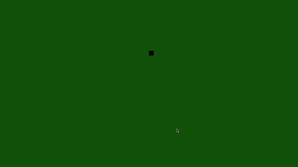
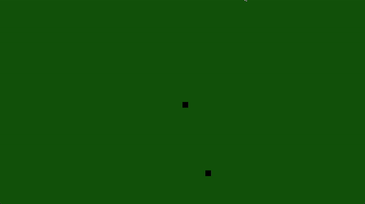

# The Snake Game - A3

Projeto para a avaliação **A3** da UC de **Estruturas Matemáticas** cujo o tema é **Matrizes**.

## Requisitos

* Python: 3.11
* Pip: 23
* GNU/Make

## Como usar

* Instalar as dependências:

  ```shell
    make deps
  ```

* Executar o ambiente virtual:

  ```shell
    make shell
  ```

* Rodar o projeto

  ```shell
    make run
  ```

## Até agora



